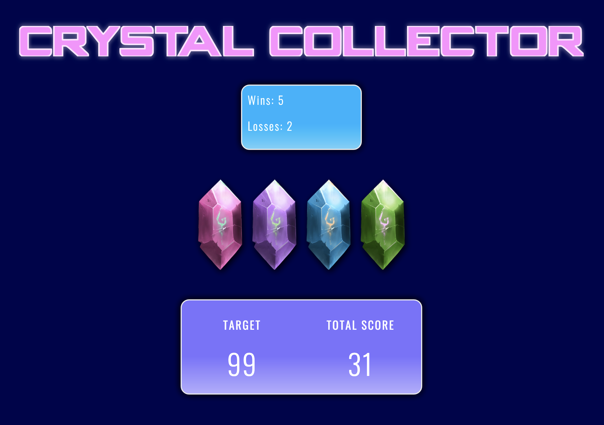
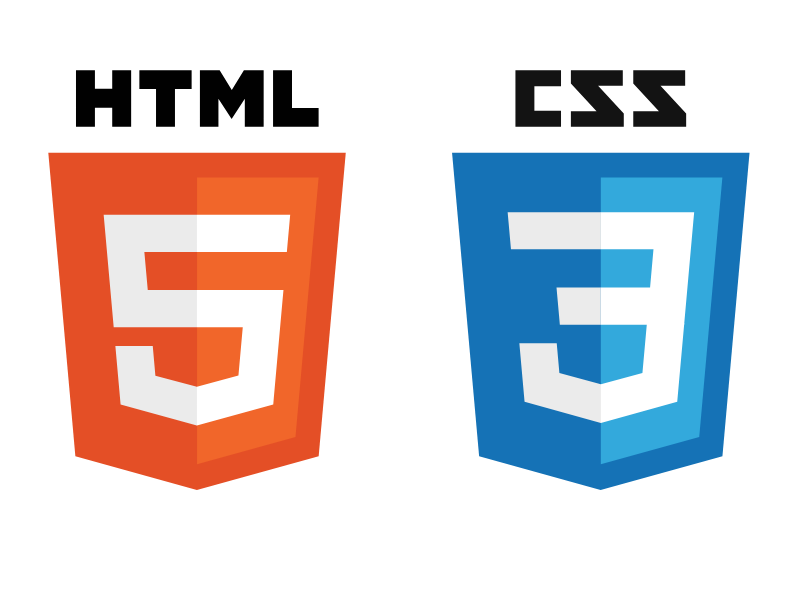

# Crystal Collector Game

## Preview

## About

<i><b>Crystal Collector</b></i> is a basic math game revolving around addition. The goal is to add hidden values through clicking the crystals to reach the target number that's given. If you go over the target value, you lose. 

## How To Play

* Click any crystal to start the game and you will be given a random number.

* There are four crystals shown. By clicking on a crystal you will add a specific amount of points to your total score.

* You will win the game by matching your total score to random number. You lose the game if your total score goes above the random number.

* The value of each crystal is hidden from you until you click on it.

* Each time when the game starts, the game will change the value of each crystal.

## Technologies

&nbsp; &nbsp;
&nbsp; &nbsp; &nbsp; 
&nbsp; &nbsp; &nbsp; 
